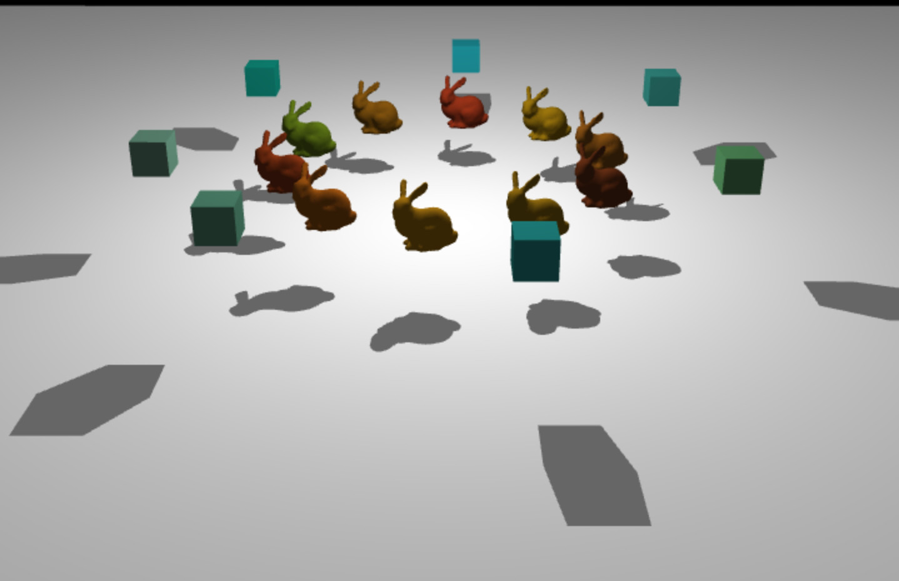

# planar_proj_shadows

Demo of Planar Projected Shadows implemented with [regl](https://github.com/mikolalysenko/regl).



[Demo here](https://erkaman.github.io/regl-fire/fire.html)

# Implementation Details

This is an implementation of Planar Projected Shadows, described in
the excellent book [Real-Time
Shadows](https://www.amazon.com/Real-Time-Shadows-Elmar-Eisemann/dp/1568814380).

Basically, if we only want a plane to receive shadows, we do not need
any Shadow Maps or Shadow Volumes. Instead, we simply define a
projection matrix *P* that project onto that plane. To then render the
shadows, we render the shadow casting geometry, but instead of
rendering them normally, (in vertex shader)we project them onto the plane using the
matrix *P*, and(in fragment shader) we render the geometry in black.

But note that the trick only works when casting shadows onto a plane.

# Build

First install all dependencies by doing

```bash
npm install
```

To then run the demo, do

```bash
npm run start
```
